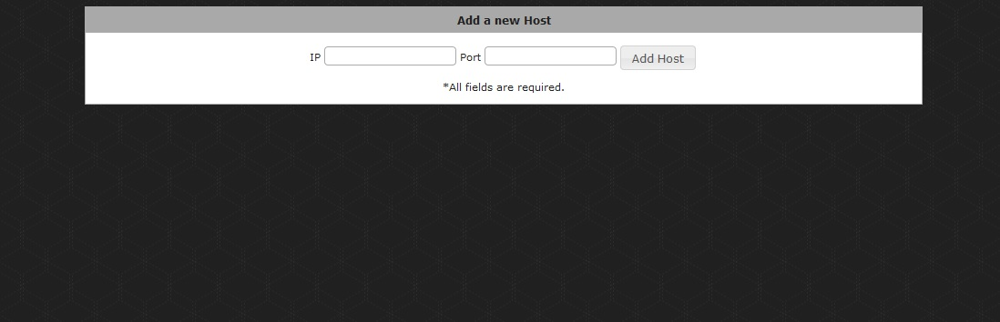
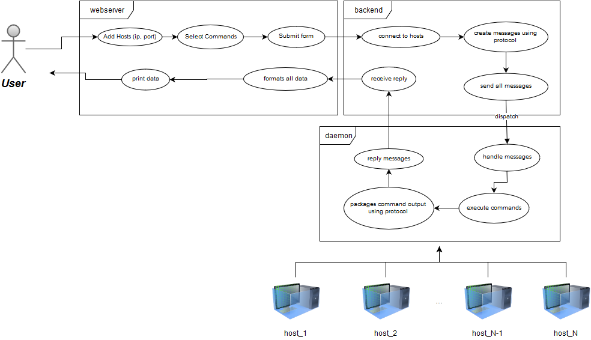

Project 1
==================================
Installation
-------------
For this installation example we're using *Ubuntu Server 14.04* and *Apache/2.4.10* (also tested with 2.4.7)

####Requirements
- Apache
- Git
```bash
sudo apt-get install apache2 git
```

####Step-by-step
Navigate to a folder using ```cd``` and clone this repository, in this example we'll be using ```~/```
```bash
cd ~
git clone https://github.com/thamenato/ufscar-redes2015.git
cd ufscar-redes2015/projeto1/ 
```
Now we need to copy the files to their respective Apache folders and change permission. Starting with CGI
```bash
sudo cp -rf cgi_bin/* /usr/lib/cgi-bin
sudo chmod 755 -R /usr/lib/cgi-bin/templates 
sudo chmod +x /usr/lib/cgi-bin/*.py
```
and now, the html
```bash
sudo mkdir /var/www/html/projeto1
sudo cp -rf html/* /var/www/html/projeto1/
sudo chmod 666 /var/www/html/projeto1/index.html  
sudo chmod 755 -R /var/www/html/projeto1/jquery
```
that shall do the trick, but if your page doesn't load the background image and css there might be a problem inside *[(webserver.py)](cgi_bin/webserver.py#L15)*. You must change the path to the correct one.

This is how the website should look like:


Running it
----------
Now that the cgi is working properly, you just need to run the [daemon.py](host/daemon.py) on each host that you want to be accessed. So, clone this repository on the host machine, navigate to the host folder and run the daemon.py script:
```bash
cd ~
git clone https://github.com/thamenato/ufscar-redes2015.git
cd ufscar-redes2015/projeto1/host/
sudo python daemon.py
```
Once it started, access the website that you are running on Apache (that should be something like *http://serverip/projeto1/*), type the host's ip and port (**default is 9999**) and click on "Add Host" button. That will add a form for that host, you can add as many hosts as you want, choose their commands and Submit at the end of the page.

Description
--------------
Briefly: Using a web interface, the user can pick from a limited set of *commands* and add arguments, if desired, that will be sent to a group of *Hosts (linux)* to execute it and reply the data back to the web interface.


Using a CGI written in Python *[(webserver.py)](cgi_bin/webserver.py)*, the user can access a web interface that allows  him to see the available hosts and the commands that can be sent: *ps*, *df*, *finger* and *uptime*. 

The CGI communicates directly with the *[backend.py](cgi_bin/backend.py)* where the *protocol* and sockets for  communicating with the host machines are defined.

To answer the *backend*, an instance of *[daemon.py](host/daemon.py)* must be running on each host machine. It keeps listening to a defined port *(default=9999)* and when the backend sends something it verifies if the *request* is valid, executes the command locally and send back the command's output.

The answer is then processed by the *webserver* that exhibits it to the user. 




Protocol of communication
----------------------
Composed by a single String using only ASCII:
```
    ["REQUEST"|"RESPONSE"][1-4][<parameters>]
```  
The first part \["REQUEST"|"RESPONSE"\] defines the type of the message:

* *REQUEST* is the message that contains the command and the parameters that will be executed.  Normally used from the *backend* to the *daemon*;
* *RESPONSE* is the reply from the *daemon* to the *backend* and contains the command that was executed  and the output that was retrieved;

Now, \[1-4\] are the Linux commands where:

1. "ps"
2. "df"
3. "finger"
4. "uptime"

And last but not least, \<parameters\> contains all the parameters that the user wants to add to each specific command.  If none is filled an empty string is added to it.
**Notes:** *parameters* can only be used in a "REQUEST" message, also, the daemon parses and verify malicious inputs like "|", ";", ">", that are not executed.
